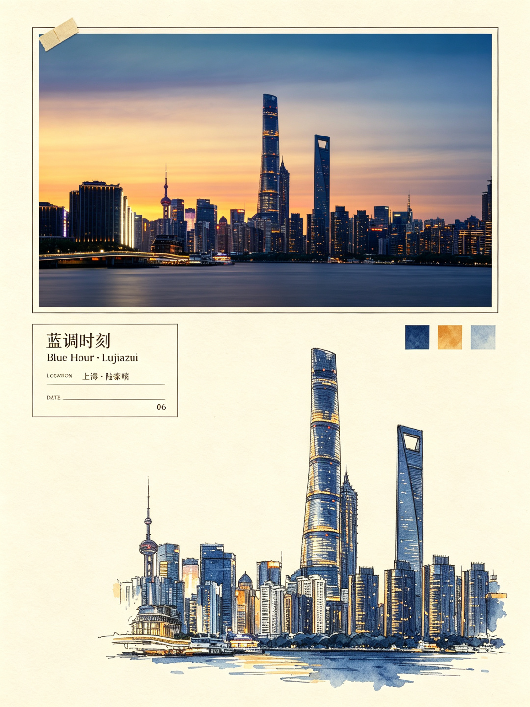
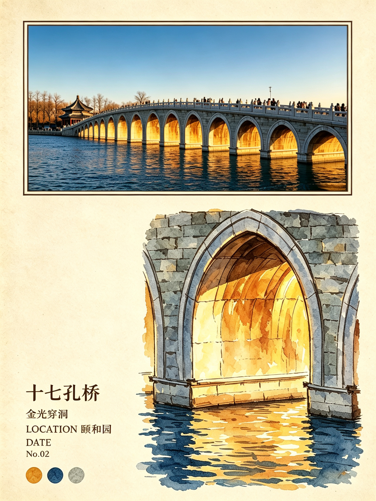
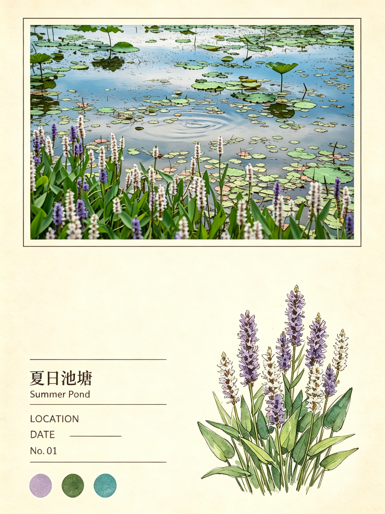
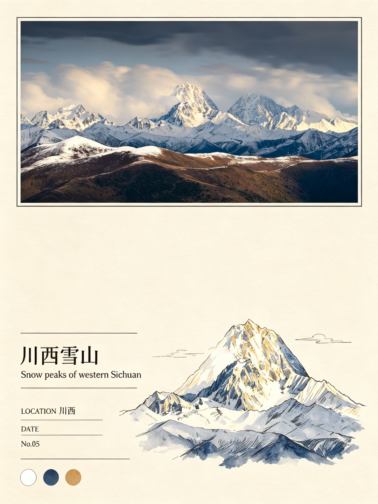
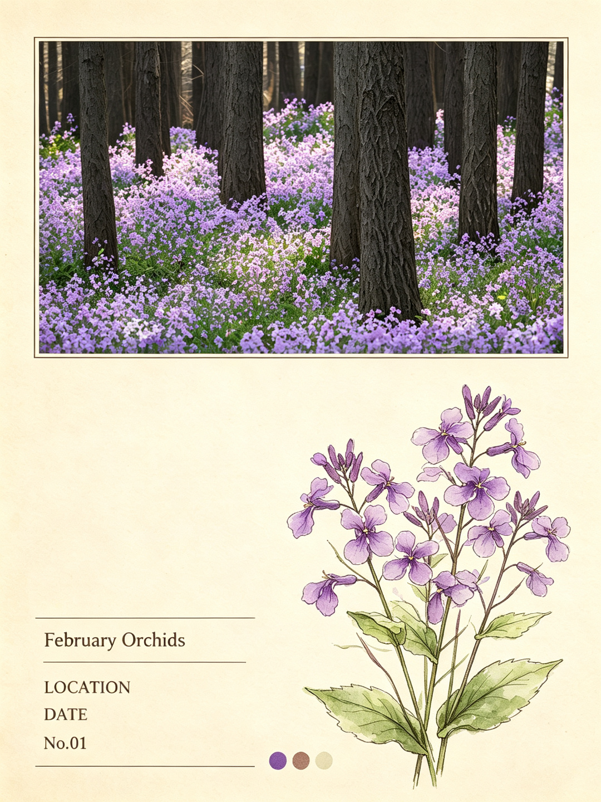
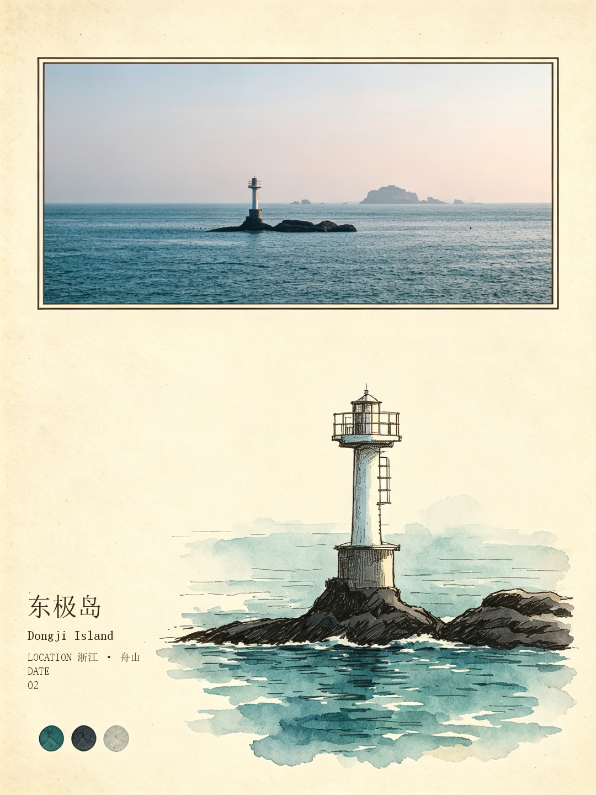
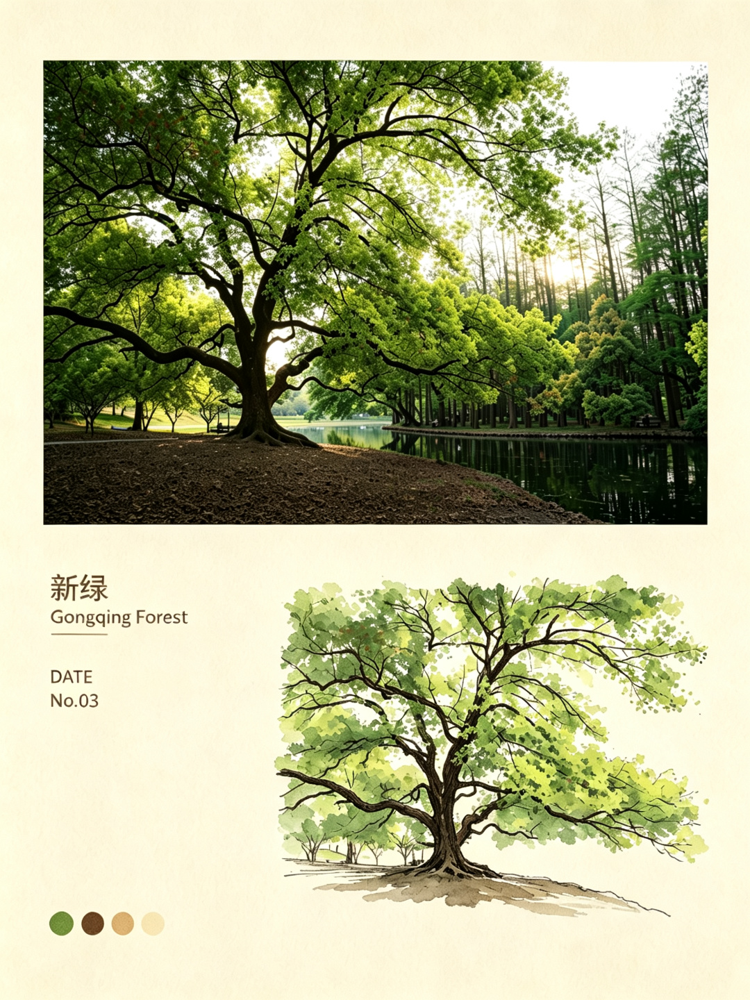
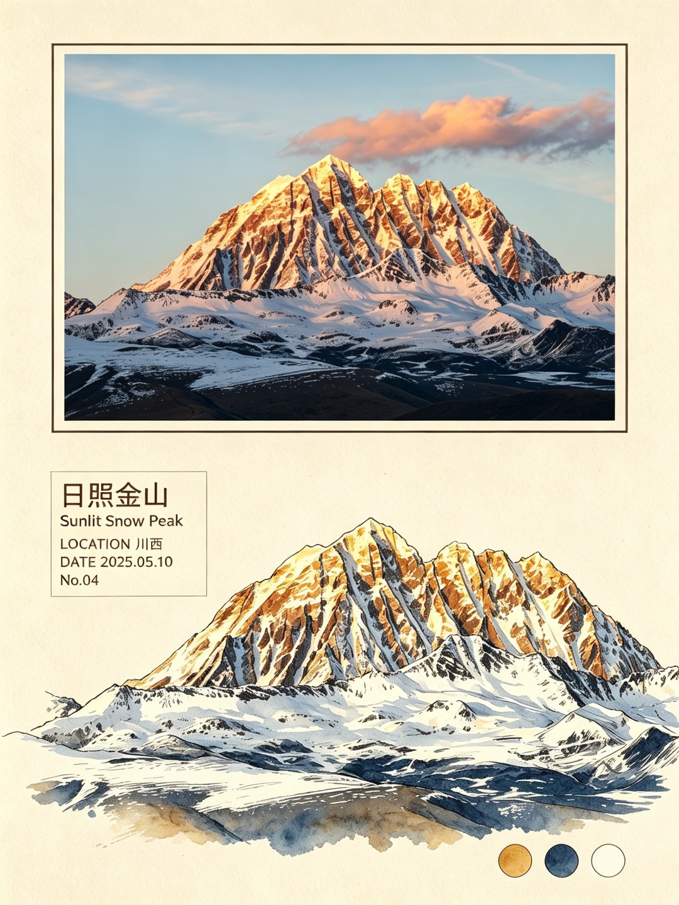

# Photo to Zine Postcard

[中文](README.md) · **English**

A zine-style photo generation skill better suited for online social media formats (e.g., Xiaohongshu). The image output aspect ratio is adjusted to 3:4 with a resolution of 1080*1440 to better meet social‑media sharing needs. The original skill’s output requirement for the back of the postcard is removed to focus on generating the front‑side image.

Turn your own photographs into minimal editorial zine-style postcards with ChatGPT.

This repository provides a reusable `SKILL.md` specification that turns one source photo into a coordinated postcard set:

- **Front** — the original photo stays intact at the top with its aspect ratio preserved; the lower area uses generous whitespace, one source-derived hand-drawn editorial motif, minimal metadata, and three sampled color swatches.
- **Back** — a matching functional postcard back with stamp area, divider, address lines, and writing space.

<table>
  <tr>
    <td><a href="assets/1lujiazui.png"></a></td>
    <td><a href="assets/2yiheyuan.png"></a></td>
    <td><a href="assets/3summer-pond.png"></a></td>
    <td><a href="assets/8-gongga-mountain.jpg"></a></td>
  </tr>
  <tr>
    <td><a href="assets/4February-Orchids.png"></a></td>
    <td><a href="assets/5dongji-island.png"></a></td>
    <td><a href="assets/6gongqing-forest.png"></a></td>
    <td><a href="assets/7yala-snow-mountain.png"></a></td>
  </tr>
</table>

The above are the current 8 official cases, covering various scenarios including city scenery, snow‑capped mountains, flowers, oceans and forests. Click the image to view the original picture.

## Quick Start

1. Give ChatGPT/doubao this repository, or upload [`SKILL.md`](SKILL.md).
2. Upload a photo you took.
3. Ask ChatGPT:

```text
Please read SKILL.md from this repository and follow it as the only design specification.
Generate a Photo to Zine Postcard front from my uploaded photo.
```

If ChatGPT cannot access the repository directly, download `SKILL.md` and upload it together with your image.

## Design Philosophy

Photo to Zine Postcard follows five principles:

1. Keep the original photograph as the visual anchor.
2. Preserve its original aspect ratio.
3. Use generous whitespace instead of filling the page.
4. Choose one visually strong, source-defining motif.
5. Reinterpret that motif carefully with a restrained hand-drawn editorial feeling.

The goal is not a generic AI poster. It is a printable personal postcard system.

## Default Output

- portrait `3:4`
- reference size `100 × 150 mm / 4 × 6 in`
- warm ivory paper
- embedded original photograph
- one main hand-drawn source motif
- optional one supporting motif
- exactly three source-derived color swatches
- matching functional postcard back

## Customize Your Own Version

This repository is designed for forking and modification. You can customize:

- illustration style
- paper texture
- typography
- postcard ratio
- metadata layout
- front/back composition
- motif extraction strategy

See [`docs/CUSTOMIZATION.md`](docs/CUSTOMIZATION.md) for a practical guide. For major style experiments, creating a variant is preferable to making the default skill more complicated.

## Repository Structure

```text
photo-to-zine-postcard/
├── SKILL.md
├── README.md
├── README_EN.md
├── CHANGELOG.md
├── CONTRIBUTING.md
├── LICENSE
├── docs/
│   └── CUSTOMIZATION.md
├── examples/
│   └── README.md
└── assets/
    ├── forest-homestead.png
    ├── ...            # remaining semantically named official examples
    └── README.md
```

## Contributing

Pull requests and derivative styles are welcome. See [`CONTRIBUTING.md`](CONTRIBUTING.md).

## License

MIT License. See [`LICENSE`](LICENSE).
